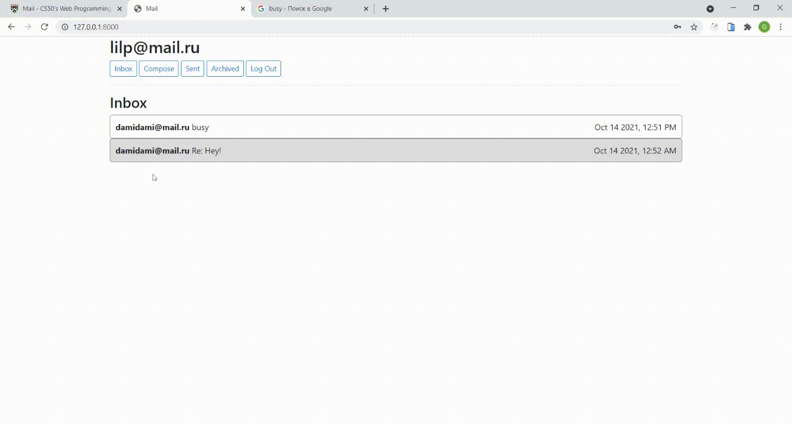

# Mail
### Project 3 of CS50 Web
A front-end for an email client that makes API calls to send and receive emails.

### Functionality
Signed in users are able to type in an email composition form and send emails.  
There are three available mailboxes Inbox, Sent and Archive.  
Users can archive and unarchive emails that they have received.  
Users can reply to an email.  

### Demo 

